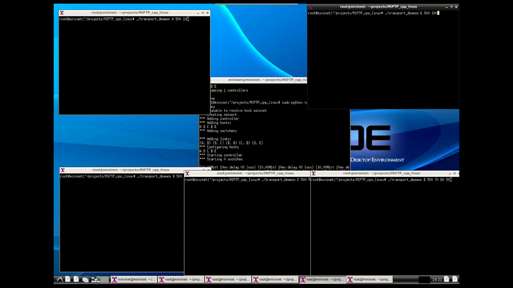
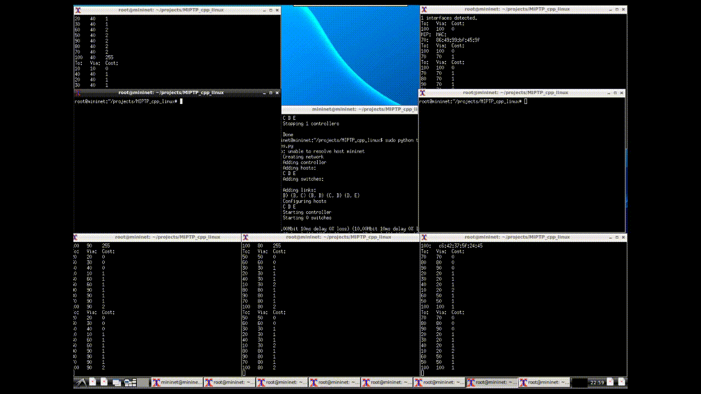

# MIPTP_cpp
Mini Internet Protocol Transport Protocol (MIPTP)
A small project to port a project that was origninally written in C to C++, and to explore/use C++ features.

## Disclaimer
This project is for educational purposes only and should not be used in any professional application.

## Goal
To implement the necessary network layers ontop of the linux raw socket interface (man 7 raw) to achieve:
* Link layer
	* Use ethernet interfaces as transmission medium.
	* Implement address resolution protocol ([ARP](https://en.wikipedia.org/wiki/Address_Resolution_Protocol)) to discover immediate neighbours.
	* Detect nodes going offline with timeouts.
* Network layer
	* Implement distance-vector routing ([DVR](https://en.wikipedia.org/wiki/Distance-vector_routing_protocol)) with split horizon to discover the network topology.
	* Every node can reach all nodes in the network.
	* Nodes can forward transport packets.
* Transport layer
	* Implement [sliding window](https://en.wikipedia.org/wiki/Sliding_window_protocol) with [Go-Back-N](https://en.wikipedia.org/wiki/Go-Back-N_ARQ).
	* Two nodes can reliably transmit data between eachother over the network (even with lossy links).

* Application layer
	* Provide an interface for Application layer programs.
	* Create a file receiving program that can receive files over the network.
	* Create a file sending program that can send files over the network.

## Design
The original C project was from a networking course I took, I've made some changes to the design requirements and added some features.

The system is divided in 3 parts, which all have their own process, and they can partially run independently. They communicate with IPC.

* __MIP_deamon__ (handles link layer).
	* In and out going ethernet frames.
	* ARP.

* __routing_deamon__ (handles network layer).
	* DVR.

* __transport_deamon__ (handles transport layer).
	* Provide interface for Applications to connect.
	* Handle handshake to connect two clients.
	* Provide Sliding window for sending client.

## Implementation details
As an exercise, I made the 3 deamons handle concurrent sockets in 3 different ways, 

* __MIP_deamon__ uses a epoll on the main thread with blocking sockets to handle all sockets.

* __routing_deamon__ uses a epoll on the main thread to handle incomming data and place them in queues, and then worker threads to pop from the queues and send data.

* __transport_deamon__ uses a epoll on the main thread with nonblocking sockets.

Todo: write discussion about how blocking sockets in this paticular design is bad.

## How to build

### Build requirements:
	gcc 4.8.4 or above

### Build:
	make

## How to run
### transport_deamon
	./transport_deamon [-d] <socket name> <timeout> [mip addresses]
	socket name : name of socket that clients use to connect
	timeout : connection timeout
	mip addresses : one or more addresses to assign the ethernet interfaces

	transport_deamon will fork-exec MIP_deamon, and MIP_deamon will fork-exec routing_deamon.

### file_compare
	./file_compare <file1> <file2>

### file_generate
	./file_generate <filename> <size>

### file_sender
	./file_sender <transport_deamon sock> <file path> <mip address> <port>

### file_receiver
	./file_receiver <transport_deamon sock> <file storage directory> <listen port>

## Test environment
To test the programs we need multiple systems connected together over ethernet connections creating a network, and we need systems (routers) with more than one ethernet interface. The easiest way to do this is to create a virtual network on a machine. For this project I used [Mininet](http://mininet.org/) to test the system.

## Demo
### DVR

	Demonstating how nodes use distance vector routing to explore the network topology, in the end every node knows of every node, and they are able to detect nodes going offline (by setting cost to ininity(255)).

### File transfer

 	Demonstating two end systems sending a file. First a ___file_receiver___ is connecting to the ___transport_deamon___ at node A listening at port 1. Then a ___file_sender___ is connecting to the ___transport_deamon___ at node E asking to connect to port 1 at address 10. The filetransfer is slow because the timeout argument for the transport_deamons is set to 1 second, by increasing this (and/or increasing the window size in the source) will speed up the transfer. 